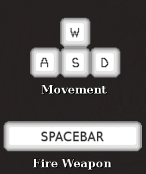

# cloud-wars
>Shooter game build with the power of Phaser3 and JS

Your score must be on the top 5 if you deserve to be in the leader board.

## Play

[Cloud-Wars](https://cloud-wars.netlify.com)

<p align="center">
  <a href="https://cloud-wars.netlify.com">
    
  </a>
</p> 

## Table of contents
[How to Play](#howto)

[Deploy](#deploy)

[GameDesignDocument](#document)

[Author](#author)

[Acknowledgements](#acknowledgements)

<a name="howto"/>

## How to Play

<p align="center">
  
</p> 

- To move your ship use the W, A, S, D keys: Up, down, left, right, respectibly.
- To shot your weapon use the space bar. 


<a name="deploy"/>

## Deploy

1. To deploy this project locally, download or clone this repo.

2. Install the dependencies to build the project
```
    npm install
```
3. Build the project with *npm run build* use the following command to start the development server :
```
    npm run start
```
4. If you make are making many changes use webpack on development mode:
```
    $ npm run dev
```
5. To run the test:
```
    $ npm run testdev
```
<a name="document"/>

## Game Design Document

### Genre

- Arcade shooter game
- Airships

### Mission
 
- Survive enemies lasers.
- Survive enemy collitions.
- Shoot all enemies.
- Get the highest score possible to enter the hall of fame.
 your score to an online leaderboard

### Platforms

- Any desktop web browser
- Keyboard required

### Project Scope 

- Use of phaser and API to store scores
- 5 days to develop and launch
- Deployed on Netlify free acount

### Influences

- Space-Shooter [Tutorial](https://learn.yorkcs.com/category/tutorials/gamedev/phaser-3/build-a-space-shooter-with-phaser-3/)
- Game template [Tutorial](https://phasertutorials.com/creating-a-phaser-3-template-part-1/)


### Project Description

- Shooter game build with JS and Phaser 3.

### What sets thos project apart

- Works on any desktop browser. 
- It is intuitive. 
- You can share your score with other players.

### Core Gameplay Mechanics

- Points sheet
    | First Header    | Score  |
    | -------------   | ------ |
    | Survived enemy  | 1      |
    | Destroyed enemy | 10     |
    | Got bonus live  | 100    |
    | Survived level  | 100    |
- If you survived the level or got a new bonus life your ship will powerup and make a gigan shoot.
- On level up enemies will apear on screen more often.
- On level up enemies will shoot more often.
- The players name recorded locally in the browser. 
- If the players score is between the top 5 will be scored. 
- Levels will add on and on, increasing enemy speed and amunition.


### Assets Needed

- Sprites:

	- Player ship 
	- Enemy ship 
	- Bonus ship 

- Sounds
  - Background
  - NewLife
  - Explosion

-   Code

	- Webpack 
	- Phase 3 Engine
	- HTML Index page
	- Jest 
	- JS Modules

### Schedule

- Day 1

  - Learn Phaser
  - Make scenes template

- Day 2

  - Plan game

- Day 3-5

  - Develop game
	-	Configure webpack
	-	Get and save scores from API
	-	Run tests


<a name="author"/>

## Author

👤 Franco Rosa

- Github: [@FrancoRosa](https://github.com/FrancoRosa)
- Linkedin: [Franco Rosa](https://www.linkedin.com/in/francoro)
- Twiteer: [@francomaker](https://twitter.com/francomaker)
## 🤝 Contributing

Contributions, issues and feature requests are welcome!
Feel free to check the [issues page](issues/).

## Show your support

Give an ⭐️ if you like this project!

<a name="acknowledgements"/>

## Acknowledgments
- [Space-Shooter Tutorial](https://learn.yorkcs.com/category/tutorials/gamedev/phaser-3/build-a-space-shooter-with-phaser-3/) The game is build from this base.
- [Game template Tutorial](https://phasertutorials.com/creating-a-phaser-3-template-part-1/). The diferent scenes are based on its template.
- Netlify to kindly host this project
- [OpenGameArt](https://opengameart.org) I took some audio effects from there.
- [EzGif](https://ezgif.com) To build this gif quick and easy
- Team #94 Capricornus Microverse, for the morning code reviews.

## 📝 License

This project is [MIT](lic.url) licensed.


